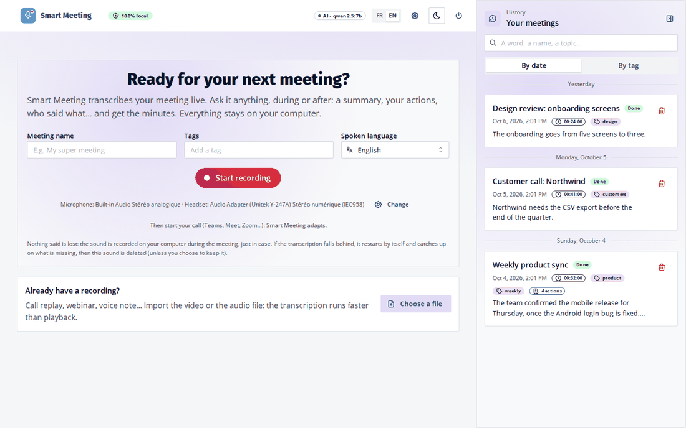
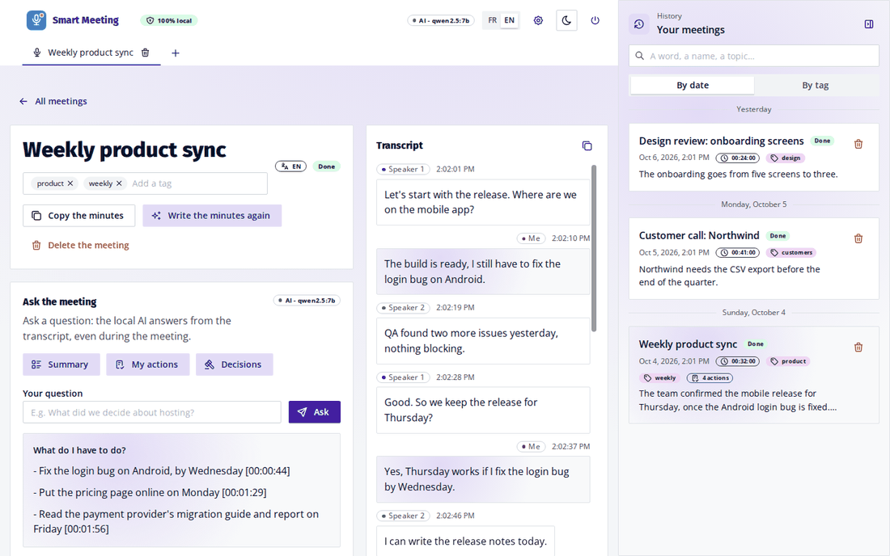
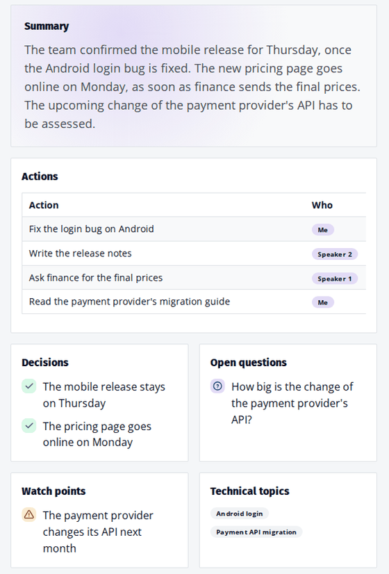
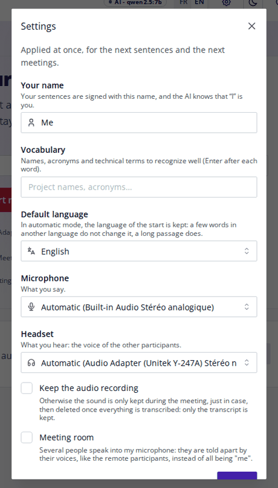

# Smart Meeting

Live transcription and automatic minutes for your meetings, **100% local**: nothing you say or hear leaves your
computer.

During a call (Teams, Meet, Zoom…), Smart Meeting listens to your microphone and to your headset, writes down who says
what, answers your questions about the meeting, and writes the minutes at the end.



## Install

**On macOS and Linux, use the app**: a real application in your Dock or applications menu, with its own window.
The browser version is for Windows (and for development).

| System | Install | Then |
|---|---|---|
| **macOS** 14+, Apple chip (M1 or later) | Download `Smart-Meeting-<version>.dmg` from the [Releases](https://github.com/graffkevin/smart-meeting/releases) page, open it and drag **Smart Meeting** to **Applications** | Open it from the Applications folder or the Dock |
| **Ubuntu** 24.04+ (GNOME) | Download `smart-meeting_<version>_all.deb` from the [Releases](https://github.com/graffkevin/smart-meeting/releases) page, then `sudo apt install ./smart-meeting_<version>_all.deb` | Super key, type "Smart Meeting"; right-click, **Pin to Dash** to keep it in the dock |
| **Windows** 10/11 | `winget install Git.Git`, then the commands below | `.\smart-meeting` in PowerShell, or double-click `smart-meeting.cmd`: it opens in your browser |

```bash
# Windows
git clone https://github.com/graffkevin/smart-meeting.git
cd smart-meeting
.\smart-meeting
```

The first launch downloads about 8 GB (AI and transcription models): 10 to 30 minutes. You can already record
meanwhile: everything said is transcribed as soon as the models are there. The next launches take a few seconds.
Behind a company proxy, the apps use the proxy of the system settings.

To update: from version 0.2.3, the app tells you when a new version is out. On Linux and in the browser version,
**Update** installs it (the package asks for your password) and restarts; on a Mac, **Download** opens its page. Your
meetings and settings are kept. Up to 0.2.2, install the new version by hand once, the same way (Windows: `git pull`,
then launch again). Every release has both packages, built by GitHub: the `.deb` and the `.dmg`, signed and
notarized by Apple (it opens without warning).

To uninstall on Linux: `sudo apt remove smart-meeting` (your meetings stay in `~/.local/share/smart-meeting/`).
From a clone of the repository, `./smart-meeting --install` puts the Linux app in the applications menu, with its
icon, without the package.

On Windows, to keep it in the taskbar: `.\smart-meeting --install`, then Start menu, right-click **Smart Meeting**,
**Pin to taskbar**.

## Use it

### 1. Start a meeting

Open Smart Meeting (on Windows, it opens in your browser). Give the meeting a name if you like, click **Start
recording**, then start your call. Smart Meeting follows the microphone and the headset your call uses.

### 2. Follow, and ask



- The **transcript** appears live on the right: your sentences on one side, the others on the other.
- Each person has a colored label ("Speaker 1", "Speaker 2"…). **Double-click a label** to name that person in the
  whole meeting. Giving the name of another speaker merges both.
- **Ask the meeting** at any time: **Summary**, **My actions**, **Decisions**, or your own question. The answer
  gives the time of the passages it relies on.

### 3. Stop and get the minutes

Click **Stop recording**. The local AI writes the minutes: summary, actions with who and when, decisions, open
questions, watch points. **Copy the minutes** gives them as text, ready to paste in an email or a wiki.



### 4. Find your meetings

The **history** on the right lists your meetings by date or by tag. The search finds a word in everything that was
said.

### Also

- **Import a recording** (call replay, webinar, voice note): "Choose a file" on the home page.
- **Settings** (⚙ at the top): your name, a vocabulary of names and acronyms to recognize, the microphone and
  headset, keep the audio or not, and **Meeting room** when several people speak into your microphone.
- **FR | EN** at the top switches the interface, the AI answers and the minutes.
- **Closing the tab** stops the app once nothing is running. A recording goes on if you close the tab by mistake.



## Good to know

- **Nothing said is lost.** The sound is kept on your computer during the meeting, just in case. If the
  transcription stops, it restarts by itself and catches up on what was missing. The sound is then deleted, unless
  you choose to keep it.
- **Long meetings** (2 or 3 hours) are fine: the AI reads the whole meeting.
- **The AI can be slow** without a large graphics card: about 2 minutes for a first question on a 30-minute meeting,
  less than one for the next ones, a few minutes for the minutes. The transcription goes on meanwhile.
- **macOS**, first meeting: a message asks to let Smart Meeting hear the computer. Click **Open the settings**, turn
  on **Terminal** (or **Smart Meeting** if you start it from the Dock), then **Quit & Reopen**. Done once for all.
- Tested on Linux. Windows and macOS are **not tested yet**.

## Privacy

Everything runs on your computer: the transcription, the AI, the storage. No audio, no transcript, no question ever
goes on the Internet. The downloads only fetch the software and the models, and the update check only reads the list
of releases on GitHub.

## Release a version

From any computer, Linux included (the Mac app is built on GitHub):

1. Change the version in `backend/pyproject.toml`, `frontend/package.json` and `macos/project.yml`, and commit.
2. `make release`: tags `v<version>` and pushes it. GitHub then builds the `.deb` and the signed, notarized `.dmg`
   (about 5 minutes, `gh run watch`) and adds them to a draft release of that tag.
3. Write the notes and publish: `gh release edit v<version> --notes-file notes.md --draft=false`. The apps then offer
   the update.

The signing secrets are stored once, from the Mac holding the certificate (`packaging/macos/ci-secrets.sh`); details
in [docs/TECHNICAL.md](docs/TECHNICAL.md) ("Releases, from any computer").

## More

How it works, advanced settings, development: [docs/TECHNICAL.md](docs/TECHNICAL.md). Design choices (in French):
[docs/ARCHITECTURE.md](docs/ARCHITECTURE.md).

[MIT license](LICENSE). Speakers are told apart with the [WeSpeaker](https://github.com/wenet-e2e/wespeaker)
ResNet34-LM model (VoxCeleb), [CC BY 4.0](https://huggingface.co/Wespeaker/wespeaker-voxceleb-resnet34-LM).
